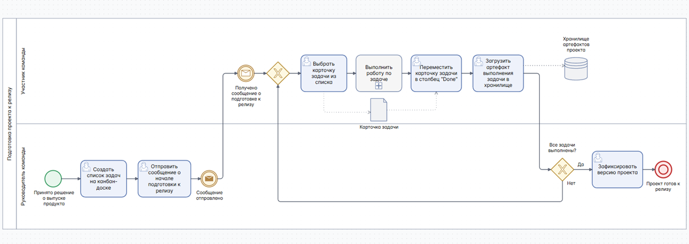
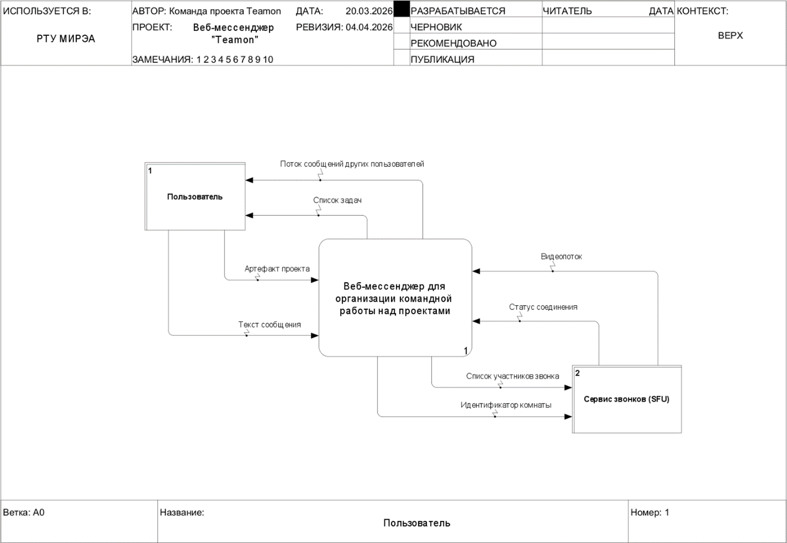
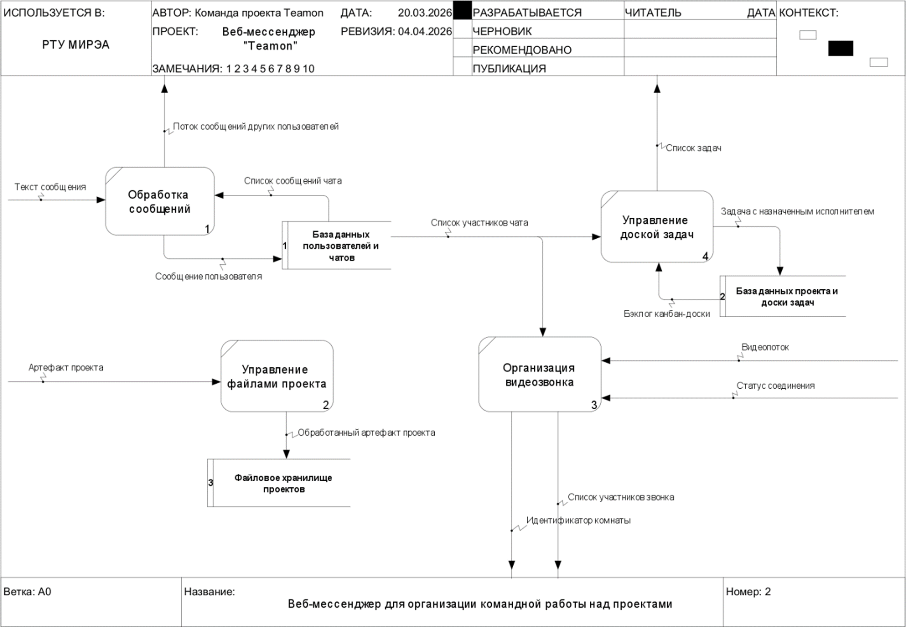
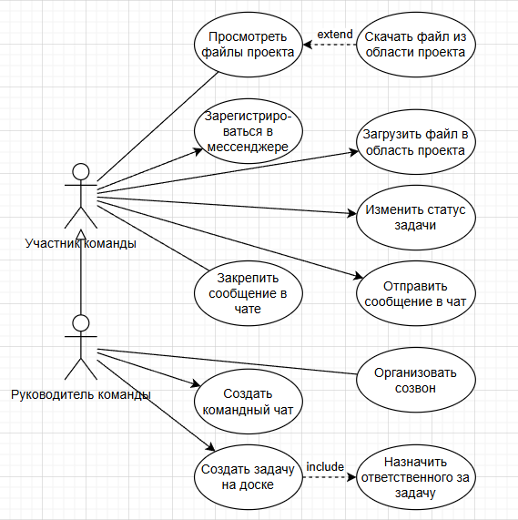
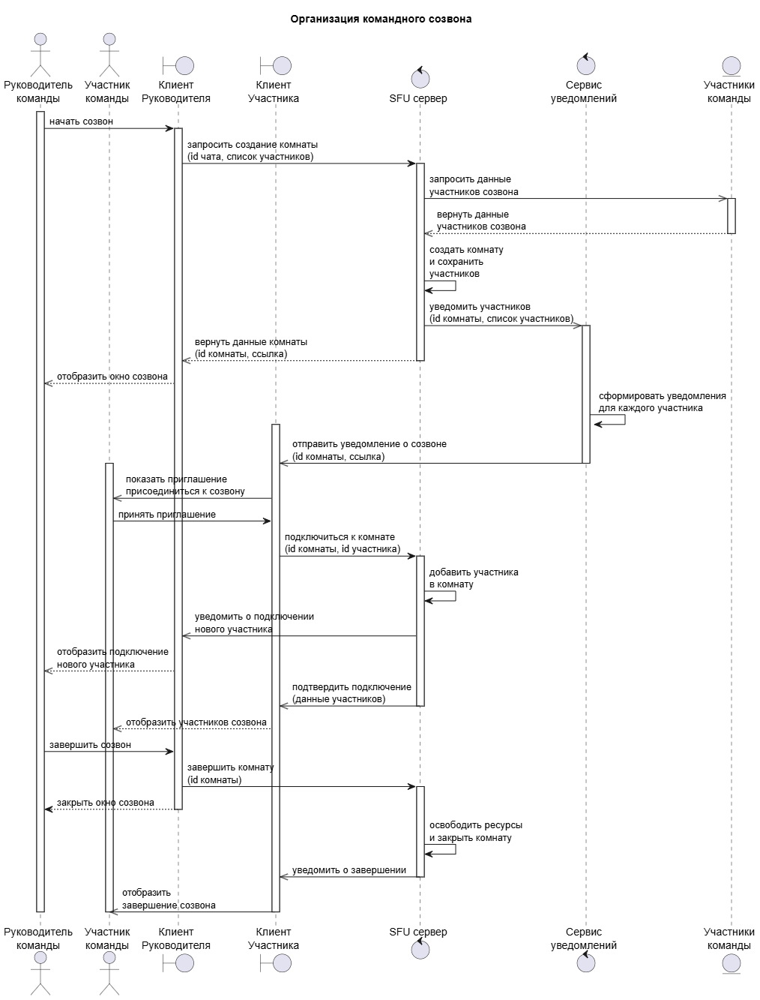
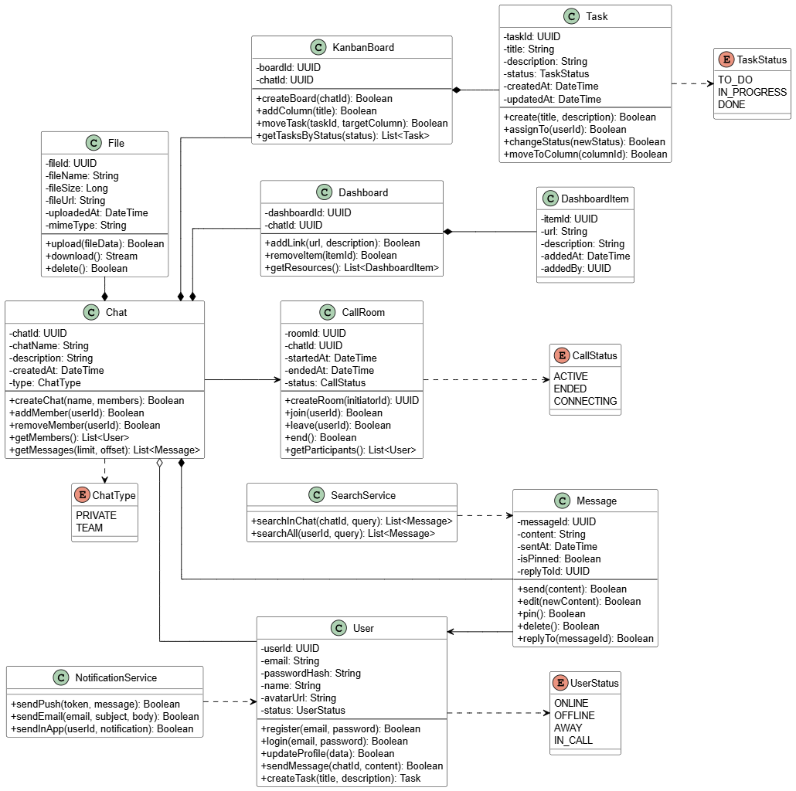
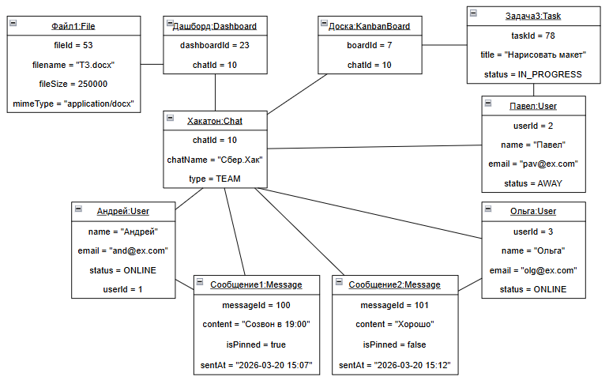
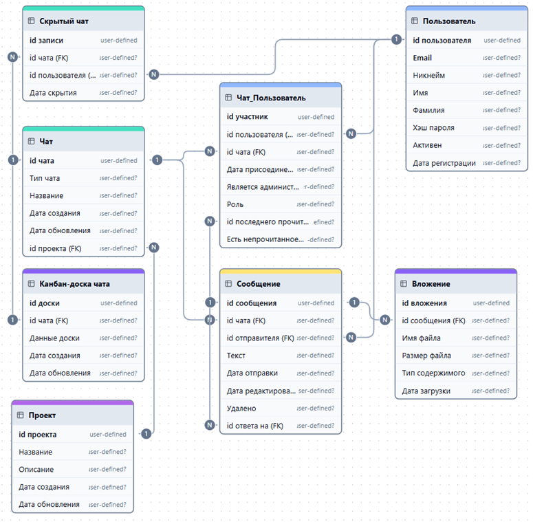
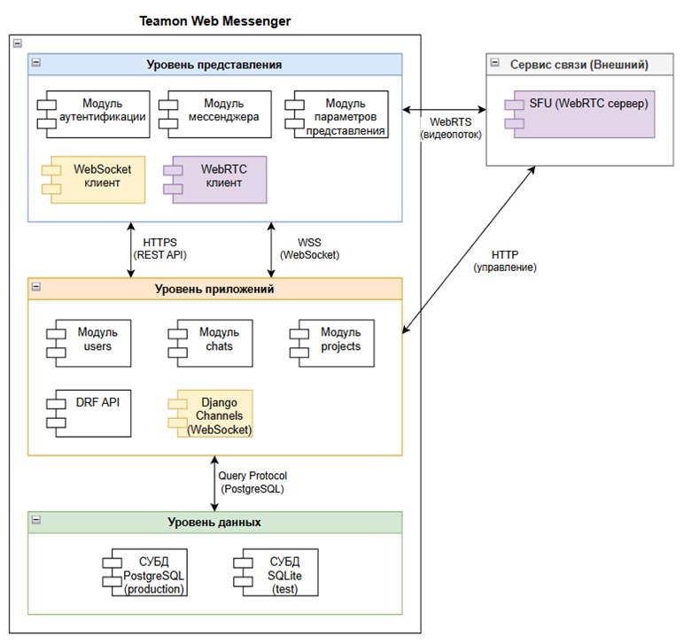

# Веб-мессенджер Teamon

Teamon представляет собой веб-мессенджер для организации командной работы над проектами.

Период проектирования и разработки: февраль-апрель 2026 г.

## Описание

С архитектурной точки зрения мессенджер представляет собой клиент-серверное приложение с клиентским SPA и RESTful API. 

Система предназначена для обеспечения информационного взаимодействия и организации совместной работы внутри команды в процессе реализации проектов.

Областью применимости системы является управление небольшими IT-проектами, учебная проектная деятельность, проведение хакатонов и прочая
командная работа.

## Продуктовая команда

|Участник | Основная роль | Дополнительная роль |
| -- | -- | -- |
| [Мусатов И.А.](https://github.com/Honsage) | Руководитель проекта | Системный аналитик |
| [Боханов В.А.](https://github.com/vbokhanov) | Фронтенд-разработчик | Дизайнер |
| [Сафаров А.А.](https://github.com/Tortarut) | Бэкенд-разработчик | Системный архитектор |
| [Комков Д.Д.](https://github.com/PriZraK528) | Тестировщик | Технический писатель |

## Пользовательские истории (User Stories)

На основе анализа предметной области командной работы над проектами были составлены [Пользовательские истории](./src/UserStories.md).

## Матрица требований

В соответствии с пользовательскими ожиданиями и техническими ограничениями составлена [Матрица требований к продукту](./src/RequirementsMatrix.md).

## Техническое задание

Для формализации требований и концепции продукта в качестве единого источника истины составлено [Техническое задание на создание автоматизированной системы Teamon](./src/ТЗ.md).

## BPMN

#### Бизнес-процесс "Подготовка проекта к релизу" (To Be с системой Teamon)

## DFD

## UML

### Диаграмма вариантов использования (Use Case)

Подробное описание прецедентов представлено в [Перечне прецедентов](./src/UseCases.md).

### Диаграмма последовательности (Sequence)

### Диаграмма классов (Class)

### Диаграмма объектов (Object)

## Логическая схема БД

## Архитектурная диаграмма

## Программная реализация

Код системы открыт и доступен по [ссылке](https://github.com/Honsage/Teamon).
