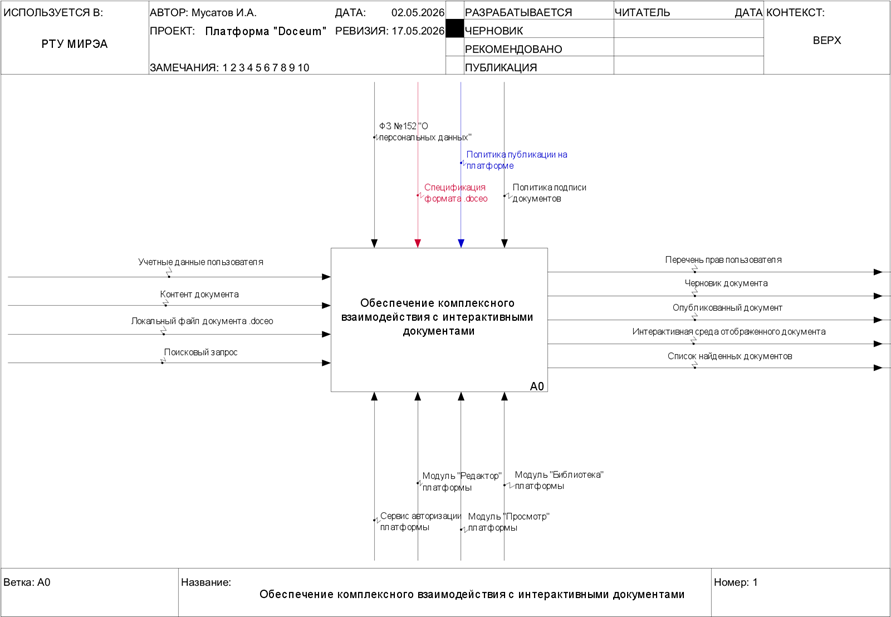
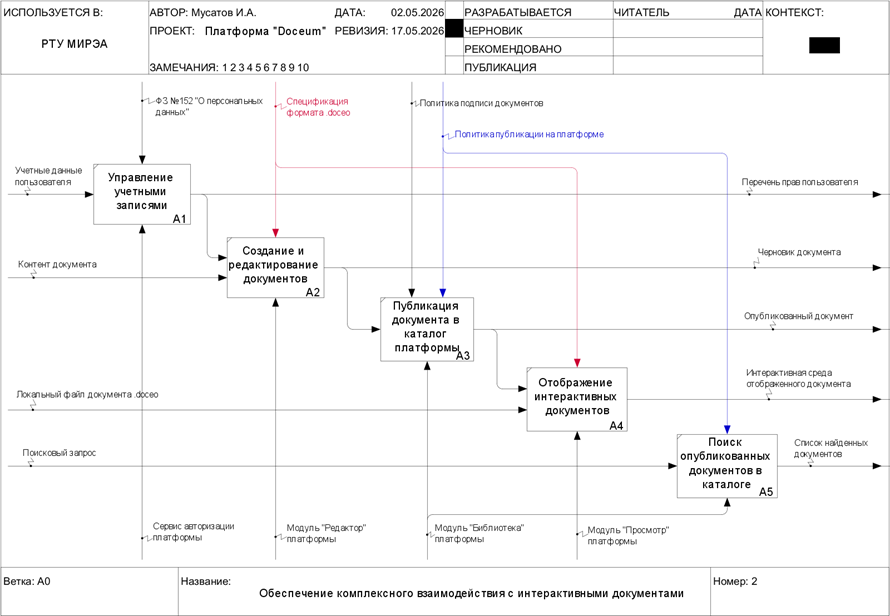
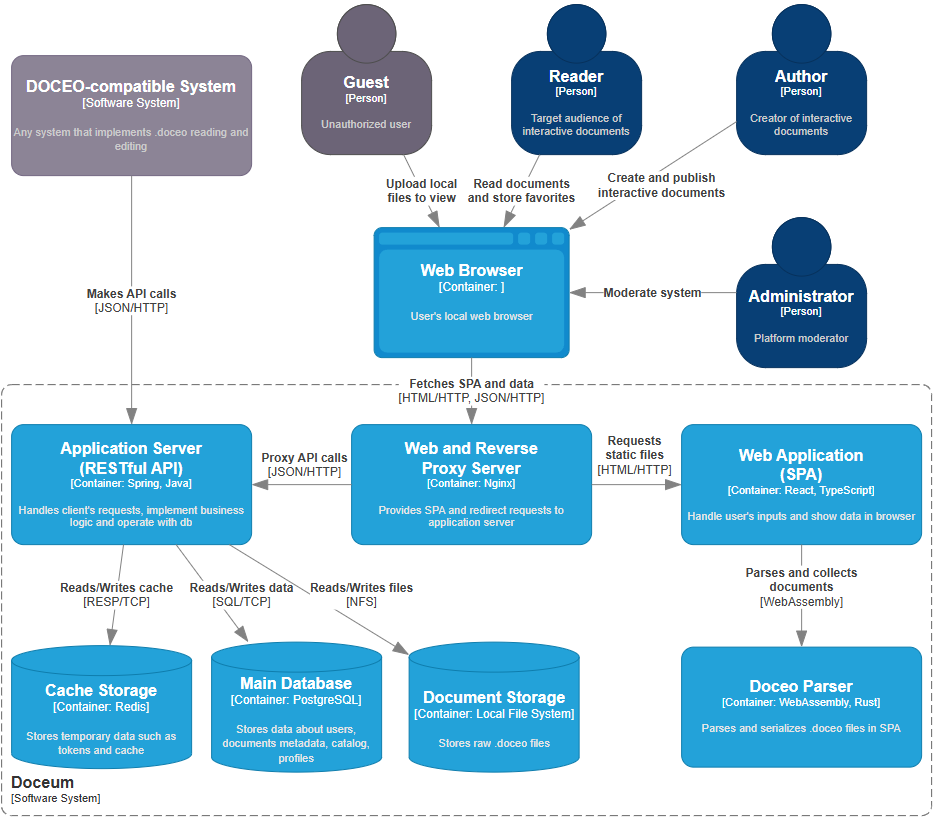
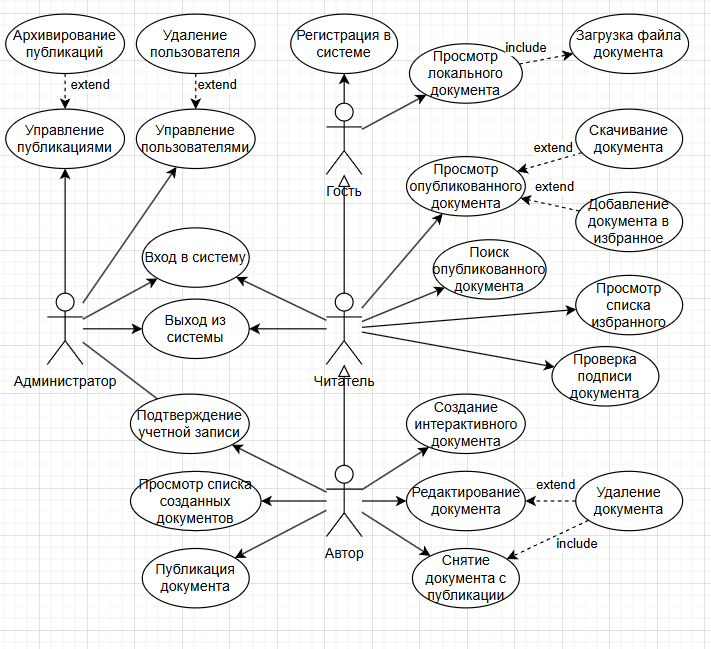
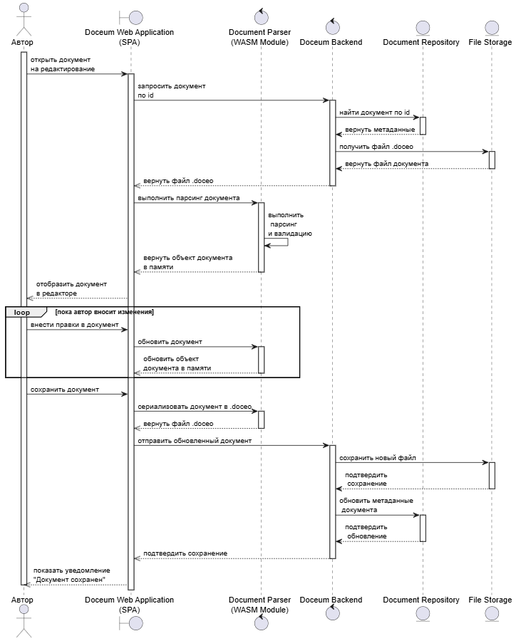
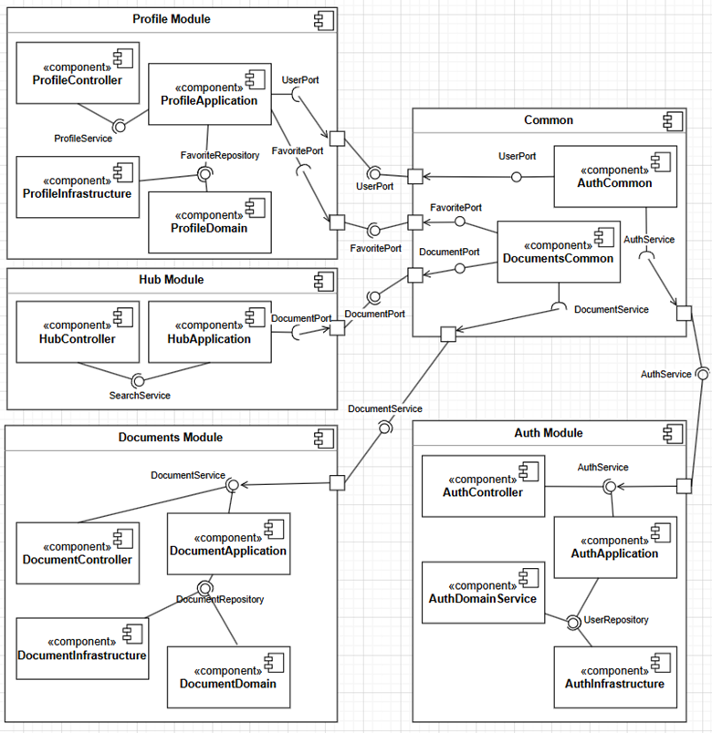
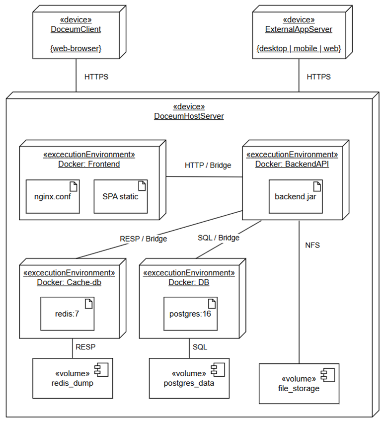
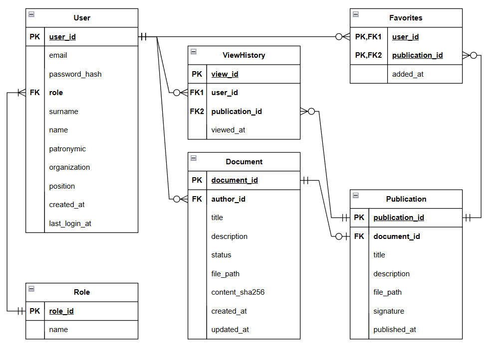

# Клиент-серверная платформа Doceum

Doceum – клиент-серверная экосистемная платформа, предоставляющая возможности создания, просмотра, распространения и публикации интерактивных документов нового формата.

Период проектирования и разработки: март – май 2026 г.

## Описание

С архитектурной точки зрения система представляет собой клиент-серверное приложение с клиентским SPA и RESTful API.

Назначением платформы является предоставление авторам современного, удобного и полностью независимого инструмента для создания, публикации, распространения и долгосрочного хранения интерактивных цифровых документов как самостоятельных цифровых артефактов.

## Спецификация формата

Платформа работает с интерактивными документами нового формата DOCEO. С форматом DOCEO можно ознакомиться по его [Официальной спецификации](https://honsage.github.io/Doceum).

## Спецификация требований к ПО

В соответствии с требованиями и ограничениями предметной области была составлена [Спецификация требований к системе Doceum](./src/SRS.md).

## IDEF0

## C4

## UML

### Диаграмма вариантов использования (Use Case)

Подробное описание прецедентов представлено в [Перечне прецедентов](./src/UseCases.md).

### Диаграмма последовательности (Sequence)

#### Для процесса «Редактирование документа» 

### Диаграмма компонентов (Component)

#### Структура компонентов серверной части платформы

### Диаграмма развертывания (Deployment)

## ERD

## Дизайн пользовательского интерфейса

Дизайн пользовательского интерфейса сделан при помощи Figma. С ним можно ознакомиться по [ссылке](https://www.figma.com/design/syDWeHawJRQ0vODRcVIC62/Doceum?node-id=0-1&p=f&t=Jv7lH1h0MbIGVVvx-0).

## Программная реализация

Код реализации системы открыт и доступен по [ссылке](https://github.com/Honsage/Sedas).
