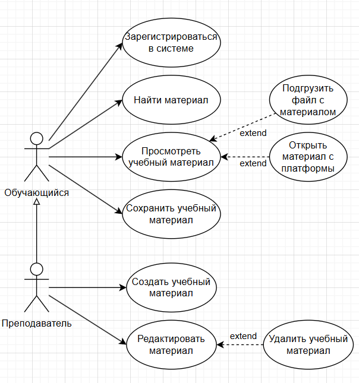
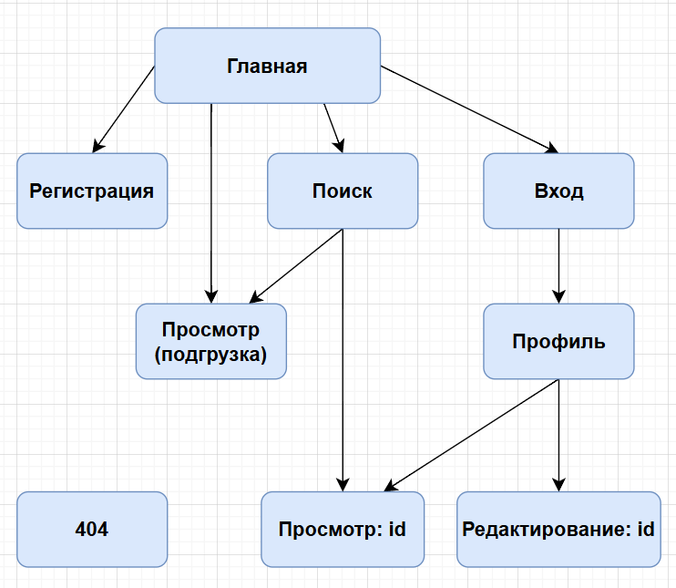

# Веб-приложение Didacticum

Didacticum – это веб-платформа для создания, просмотра и распространения интерактивных образовательных материалов.

Период проектирования и разработки: май 2025 г.

## Описание

В данном документе представлены диаграмма и схема для устаревшего проекта платформы. Актуальный проект подобной платформы расположен в директории "Веб-приложение Doceum". Помимо проекта для данной платформы разработан дизайн интерфейса, ознакомиться с которым можно в соответствующем разделе данного документа.

## UML

### Диаграмма вариантов использования (Use Case)

## Схема межстраничной навигации

## Дизайн пользовательского интерфейса

Дизайн пользовательского интерфейса сделан при помощи Figma. С ним можно ознакомиться по [ссылке](https://www.figma.com/design/h2aHFylxpKfKS4xWCtTkc3/Didacticum?node-id=0-1&p=f&t=sWEmC0C702bPrwwn-0).

## Программная реализация

Код реализации клиентской части данной платформы открыт и доступен по [ссылке](https://github.com/Honsage/Didacticum).
