# ИС ДОУ

Информационная система "Управление дошкольным образовательным учреждением" предназначена для автоматизации организационно-методического и кадрового учета, а также информационного обеспечения педагогической деятельности ДОУ.

Период проектирования: февраль – апрель 2026 г.

## Описание

В документе представлены техническая документация, диаграммы и расчеты, реализованные в рамках проектирования данной ИС.

## Техническое задание

В соответствии с бизнес-требованиями и ограничениями предметной области было составлено [Техническое задание на создание ИС УДС](./src/ТЗ.md)

## Эскизный проект

С полным описанием ключевых архитектурных решений можно ознакомиться в [Пояснительной записке к эскизному проекту](./src/ЭП.md).

#### Схема функциональной структуры системы

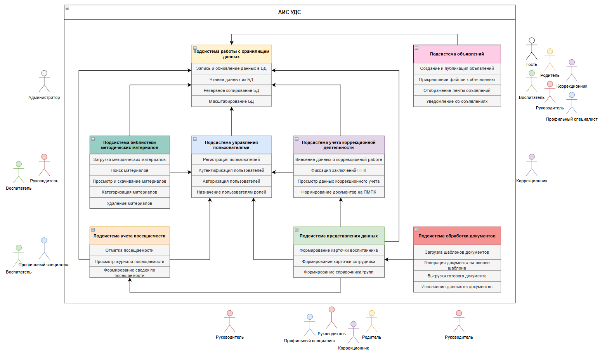

## BPMN

AS IS Процесс "Учет посещаемости воспитанников" в ДОУ.

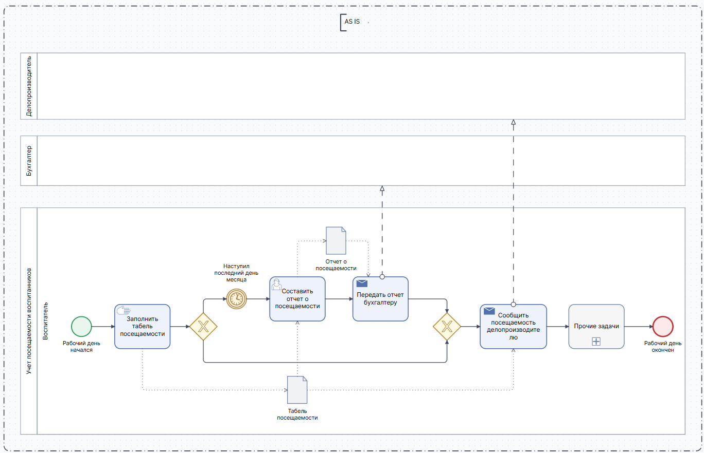

TO BE Процесс "Учет посещаемости воспитанников".

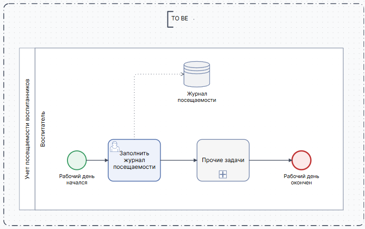

## IDEF0

Подробное описание функциональной модели системы доступно в [Пояснительной записке к модели IDEF0](./src/IDEF.md)

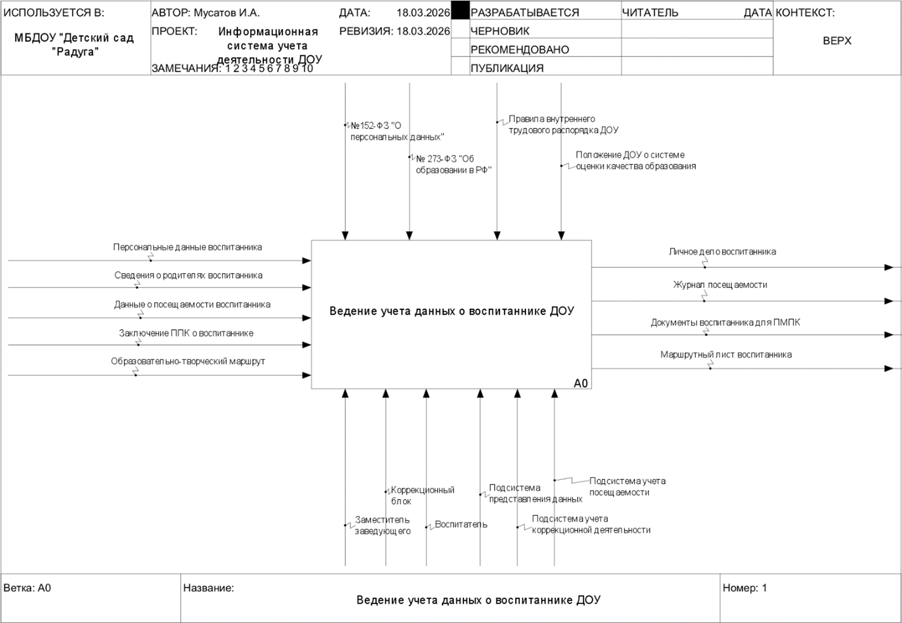
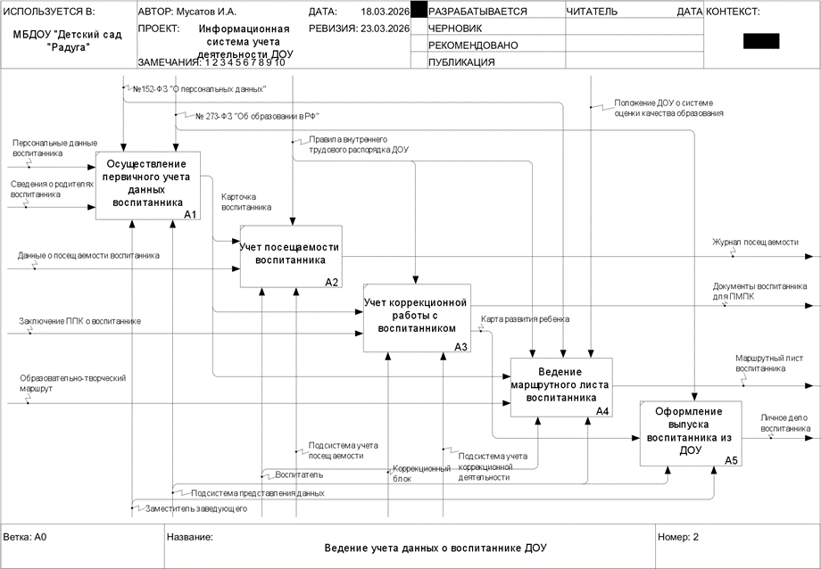
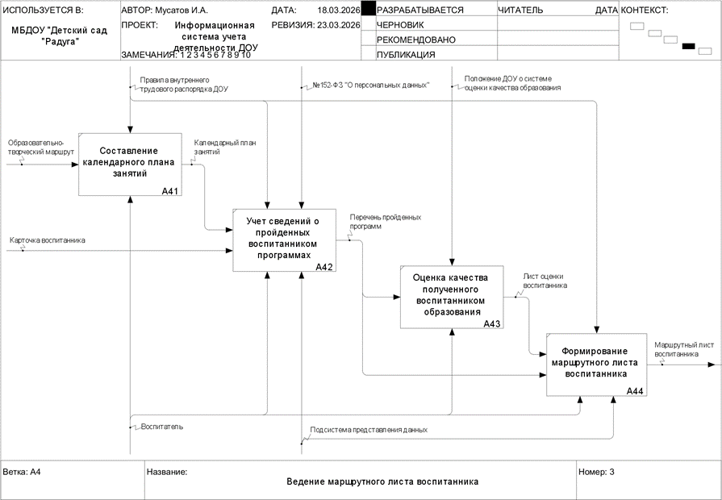

## DFD

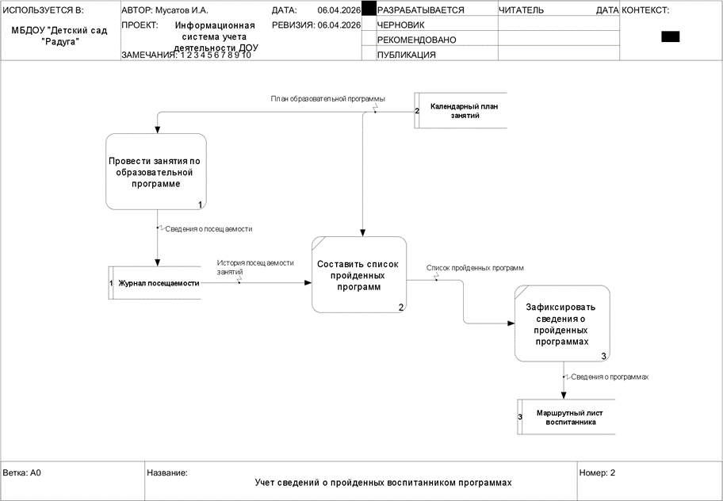
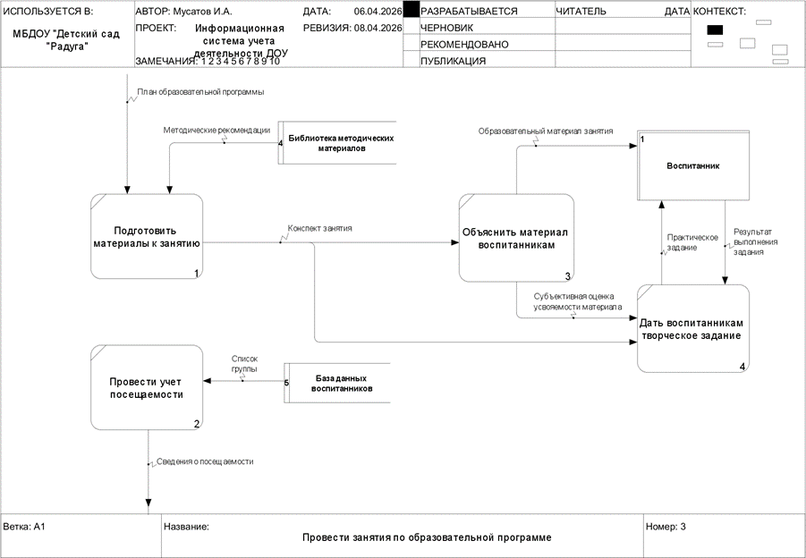

## UML

### Диаграмма вариантов использования (Use case)

#### Часть 1

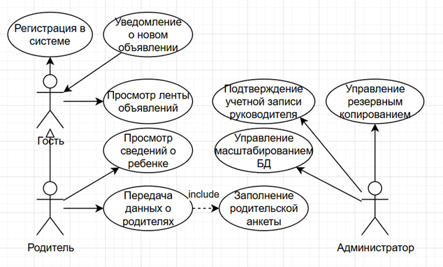

#### Часть 2

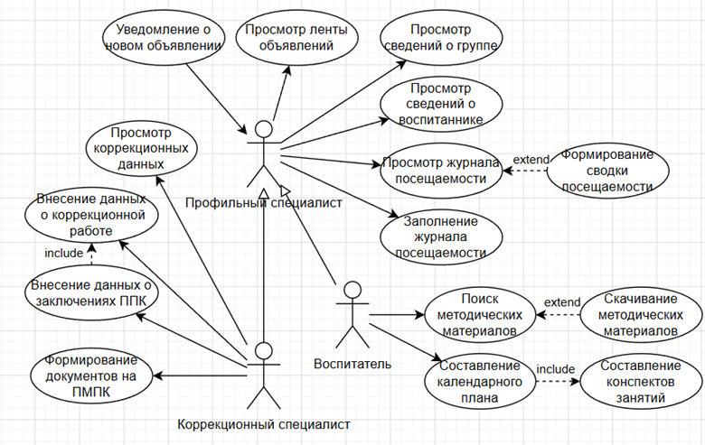

#### Часть 3

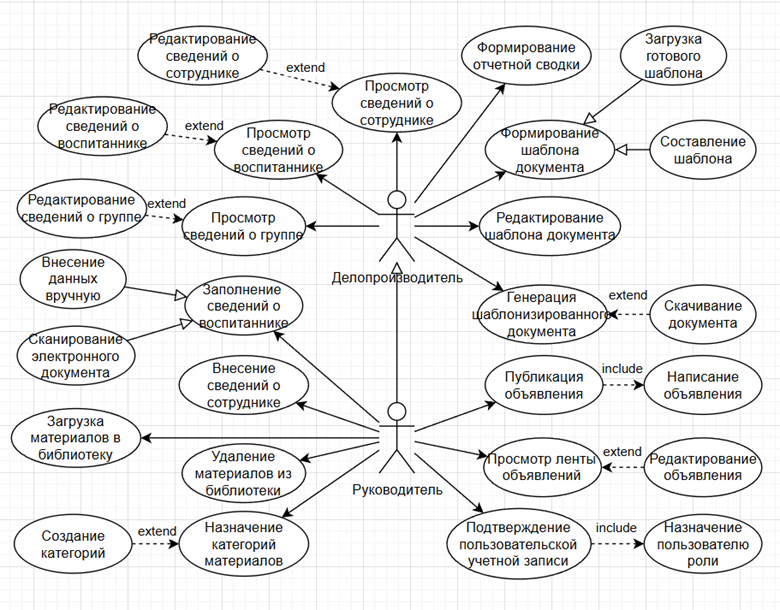

Подробное описание прецедентов представлено в [Перечне прецедентов](./src/UseCases.md).

### Диаграмма состояний (State Machine)

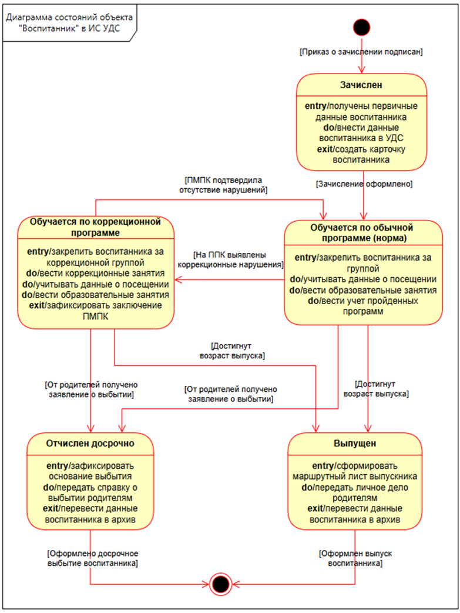

## ERD

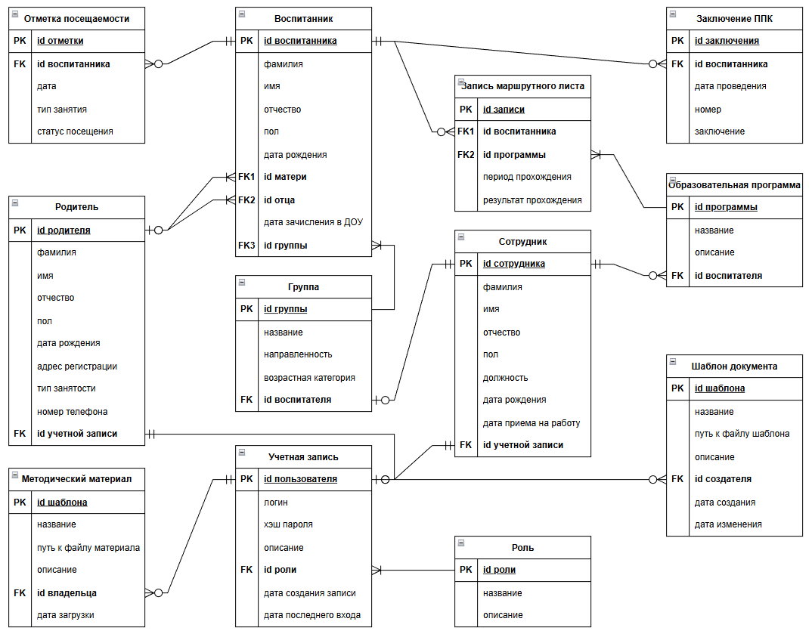

## Расчет информационной энтропии системы

Для системы УДС произведен расчет информационной энтропии нескольких элементарных семантических единиц. Ознакомиться с расчетами и их результатами можно в [Приложенном отчете](./src/Entropy.md).
