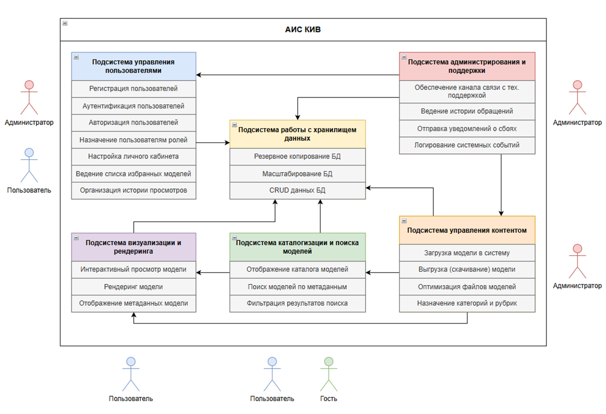
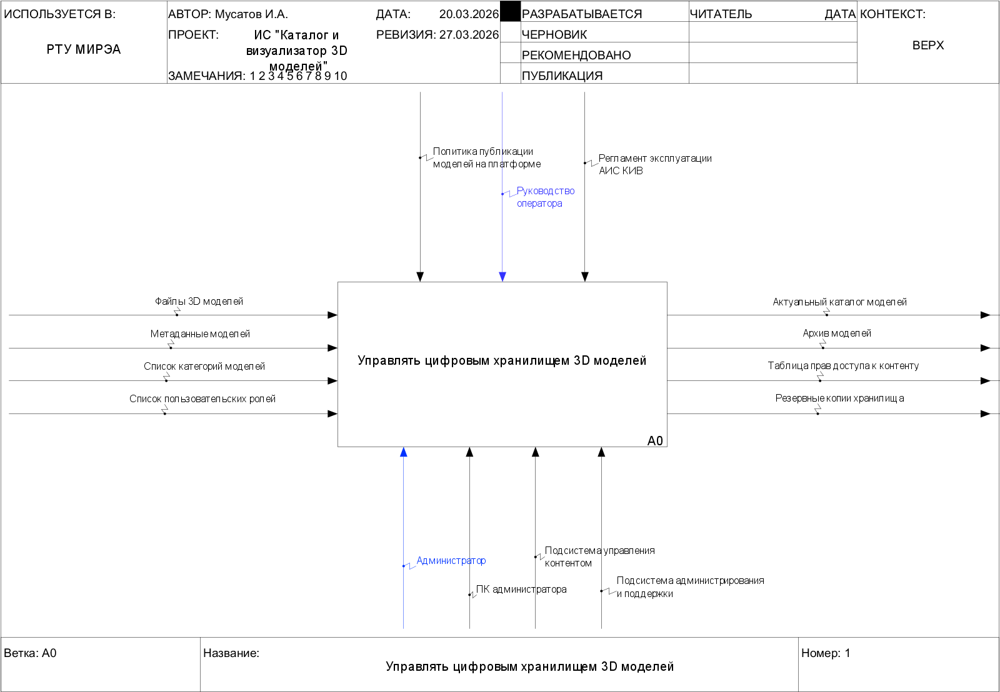
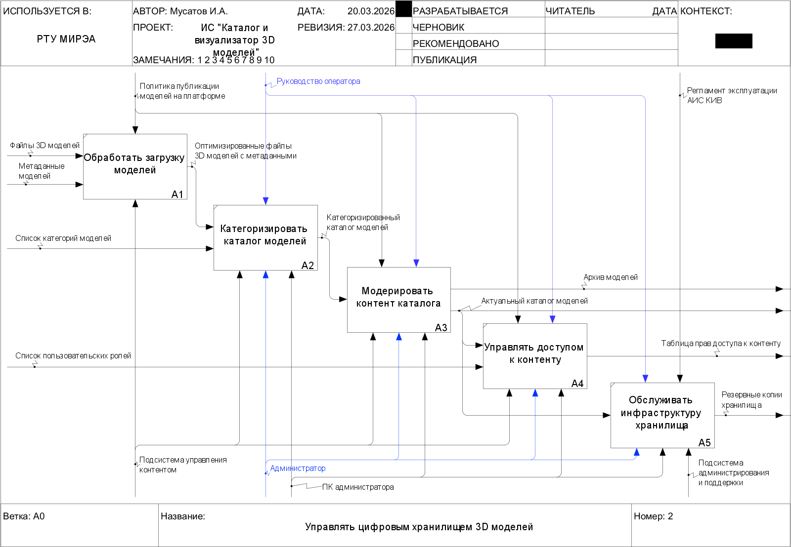
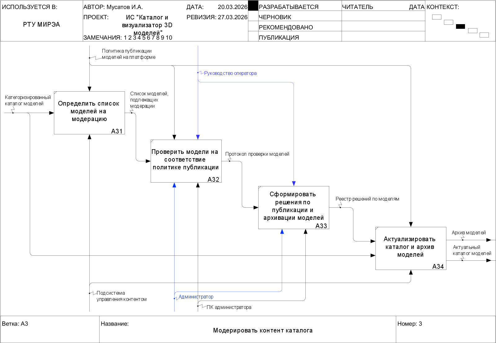
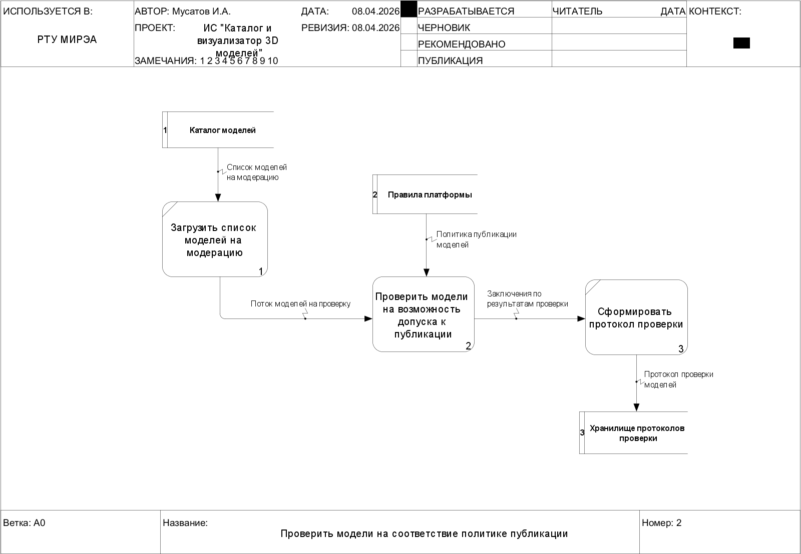
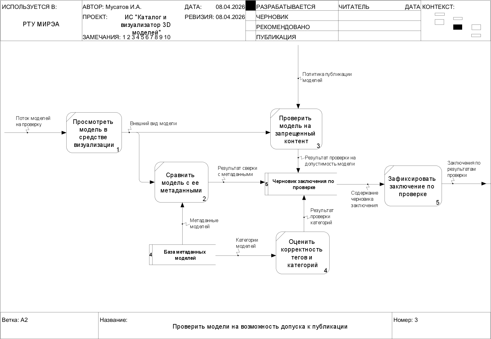
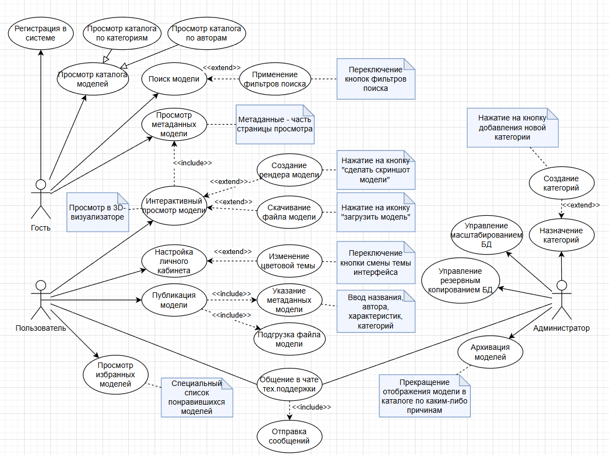
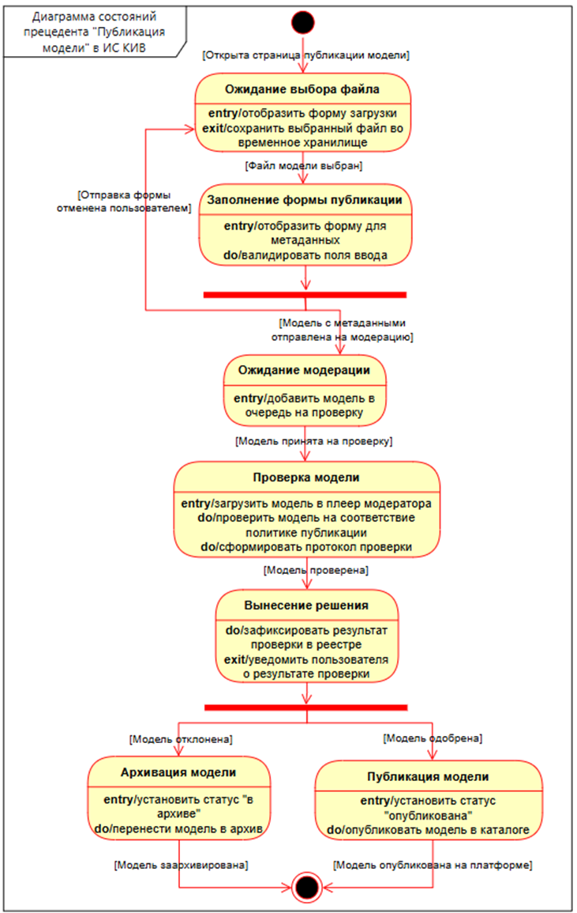
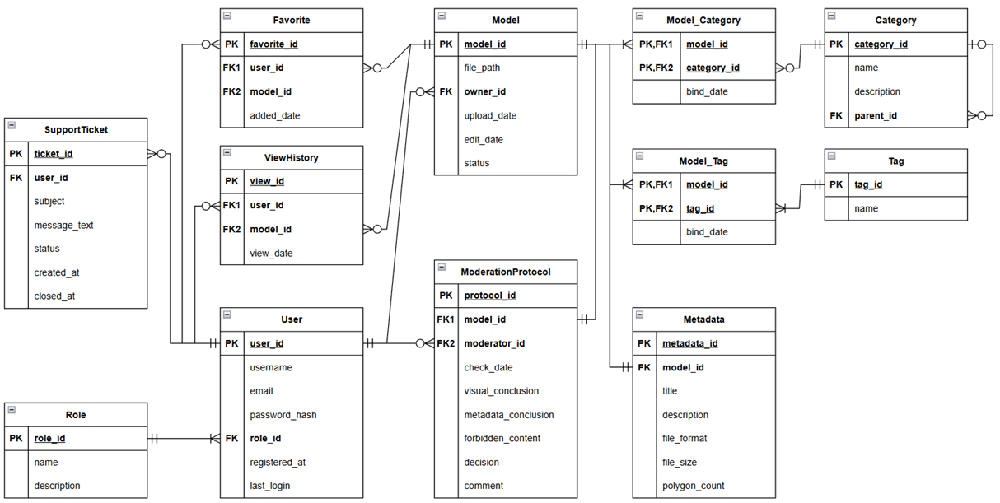

# ИС Каталог 3D моделей

Информационная система "Каталог и визуализатор моделей" предназначена для организации централизованного систематизированного цифрового хранилища трехмерных моделей и облегчения процесса их поиска и просмотра.

Период проектирования: февраль – май 2026 г.

## Описание

В документе представлены техническая документация, диаграммы и расчеты, реализованные в рамках проектирования данной ИС.

## Техническое задание

В соответствии с бизнес-требованиями и ограничениями предметной области было составлено [Техническое задание на создание ИС КИВ](./src/ТЗ.md).

#### Схема функциональной структуры системы

## IDEF0

Подробное описание функциональной модели системы доступно в [Пояснительной записке к модели IDEF0](./src/IDEF.md)

## DFD

## UML

### Диаграмма вариантов использования (Use case)

Подробное описание прецедентов представлено в [Перечне прецедентов](./src/UseCases.md).

### Диаграмма состояний (State Machine)

## ERD

## Расчет информационной энтропии системы

Для системы КИВ произведен расчет информационной энтропии нескольких элементарных семантических единиц. Ознакомиться с расчетами и их результатами можно в [Приложенном отчете](./src/Entropy.md).

## Оценка сложности алгоритмов обработки данных

Помимо прочего произведена оценка сложности ключевых алгоритмов ИС. Ход расчета сложности и результаты представлены в [Приложенном отчете](./src/Complexity.md).