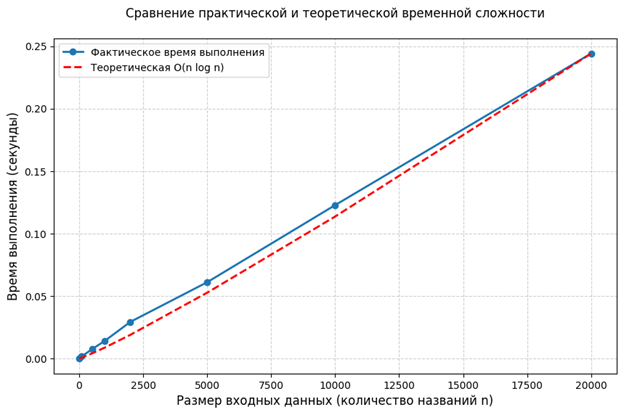

# Оценка сложности алгоритмов обработки данных системы КИВ

## 1. Выбор алгоритма для анализа

Для анализа выбран алгоритм нечеткого поиска по названиям 3D-моделей с использованием расстояния Левенштейна. Этот алгоритм непосредственно востребован в проектируемой информационной системе «Каталог и визуализатор 3D-моделей» (АИС КИВ), так как пользователи часто вводят названия с опечатками или неточными формулировками (например, «комфорка» вместо «конфорка», «линолиум» вместо «линолеум» и т.п.).

### 1.1. Формальная постановка задачи

Разработать и проанализировать алгоритм, который для введенной строки `query` выберет из заранее заданного массива `titles` из $n$ строк $k$ лучших совпадений. На основе анализа определить временную и емкостную сложность.

**Входы алгоритма:**
- массив `titles` из $n$ строк – названия моделей в системе. Например: `["Стул офисный", "Стулья", "Стол письменный", ...]`;
- строка `query` – поисковый запрос пользователя (с возможными опечатками);
- целое число $k$ – количество лучших совпадений (результатов), которые нужно вернуть.

**Выход алгоритма:**
- массив `results` из $k$ строк – перечень названий моделей, наиболее похожих на запрос, отсортированный по критерию похожести.

**Критерий похожести** – расстояние Левенштейна – минимальное количество вставок, удалений и замен символов, необходимых для преобразования одной строки в другую. Связь с похожестью: похожесть обратно пропорциональна расстоянию.

---

## 2. Описание алгоритма

Алгоритм состоит из двух вложенных уровней:

- **Внешний уровень:** для каждого названия модели в системе вычисляется расстояние Левенштейна до строки запроса.
- **Внутренний уровень:** само вычисление расстояния Левенштейна методом динамического программирования (матрица размером $m+1$ на $p+1$, где $m$ – длина строки запроса `query`, а $p$ – длина строки заголовка модели).

### 2.1. Шаги алгоритма

1. Инициализировать массив `results = []`.
2. Для каждого названия `title` из массива `titles`:
   - вычислить расстояние `dist = levenshtein(query, title)`;
   - добавить в `results` пару `(title, dist)`.
3. Отсортировать `results` по полю `dist` по возрастанию.
4. Вернуть первые $k$ названий из отсортированного массива.

### 2.2. Алгоритм расстояния Левенштейна

Для строк `query` (длины $m$) и `title` (длины $p$) создается матрица `dp` размером $m+1$ на $p+1$ и заполняется следующим образом:

- `dp[0][j] = j` для всех $j$ (нужно $j$ вставок, чтобы получить из пустой строки `b[:j]`);
- `dp[i][0] = i` для всех $i$ (нужно $i$ удалений, чтобы из `a[:i]` получить пустую строку).

Затем для каждого $i$ от 1 до $m$ и для каждого $j$ от 1 до $p$:

- `cost = 0`, если `a[i-1] == b[j-1]`, иначе `cost = 1`;
- `dp[i][j] = min(dp[i-1][j] + 1, dp[i][j-1] + 1, dp[i-1][j-1] + cost)`.

Результат вычисления расстояния находится в ячейке `dp[m][p]`.

---

## 3. Практическая оценка временной сложности

Для практической оценки реализуем алгоритм на языке Python и произведем замеры времени выполнения при различных размерах входных данных. Реализация функций подсчета расстояния Левенштейна и нечеткого поиска, а также замер времени выполнения алгоритма представлены в листинге 1.

**Листинг 1 – пример реализации алгоритма на Python**

```python
import time
import random

# Расстояние Левенштейна
def levenshtein_distance(a, b):
    m, n = len(a), len(b)
    dp = [[0] * (n + 1) for _ in range(m + 1)]
    for i in range(m + 1):
        dp[i][0] = i
    for j in range(n + 1):
        dp[0][j] = j
    for i in range(1, m + 1):
        for j in range(1, n + 1):
            cost = 0 if a[i-1] == b[j-1] else 1
            dp[i][j] = min(dp[i-1][j] + 1,
                           dp[i][j-1] + 1,
                           dp[i-1][j-1] + cost)
    return dp[m][n]

# Нечеткий поиск
def fuzzy_search(titles, query, k=5):
    scores = []
    for title in titles:
        dist = levenshtein_distance(query, title)
        scores.append((title, dist))
    scores.sort(key=lambda x: x[1])
    return [title for title, _ in scores[:k]]

# Пример замера времени работы
n_sizes = [10, 100, 500, 1000, 2000, 5000, 10000, 20000]

results_time = []
for n in n_sizes:
    titles = generate_titles(n, word_pool=words_pool)
    # Запрос: "стол" (краткий, частотный)
    query = "стол"
    start = time.perf_counter()
    fuzzy_search(titles, query, k=5)
    end = time.perf_counter()
    elapsed = end - start
    results_time.append((n, elapsed))
    print(f"n={n:5d}, time={elapsed:.6f} sec")

print("\nСводная таблица:")
print("n\t\tВремя (сек)")
for n, t in results_time:
    print(f"{n}\t\t{t:.6f}")
```

### 3.1. Результаты практической оценки

Приведем результаты практической оценки временной сложности алгоритма в виде таблицы (см. таблицу 1).

**Таблица 1 – Результаты практической оценки временной сложности**

| $n$ (количество названий) | Время (сек) |
|---------------------------|-------------|
| 10 | 0.000157 |
| 100 | 0.001424 |
| 500 | 0.007203 |
| 1000 | 0.013856 |
| 2000 | 0.029106 |
| 5000 | 0.060861 |
| 10000 | 0.122628 |
| 20000 | 0.244063 |

---

## 4. Подсчет операций алгоритма

Будем подсчитывать количество элементарных операций в наихудшем случае. Длину запроса обозначим $m$, длину названия модели – $p$. В наихудшем случае $m = p = L$, где $L$ – максимальная длина строки.

### 4.1. Внутренний алгоритм Левенштейна

Для двух строк длины $L$ (см. таблицу 2).

**Таблица 2 – Данные для подсчета операций во внутреннем алгоритме**

| Операция | Количество выполнений |
|----------|----------------------|
| Инициализация матрицы $(L+1)$ на $(L+1)$ | $(L+1)^2$ |
| Заполнение первой строки и первого столбца матрицы | $2L$ |
| Вложенные циклы ($L \cdot L$) итераций | $L^2$ |
| Сравнение символов | $L^2$ |
| Вычисление `cost` (0 / 1) по условию | $\leq L^2$ |
| Вычисление `min` из трех чисел (3 операции сравнения + присваивание) | $4 \cdot L^2$ |

В наихудшем случае получаем следующее суммарное число операций для алгоритма Левенштейна на одну пару строк (см. формулу 1).

$$T_{lev}(L) = 8 \cdot L^2 + 4L \tag{1}$$

### 4.2. Внешний уровень

**Таблица 3 – Данные для подсчета операций во внешнем алгоритме**

| Операция | Количество выполнений |
|----------|----------------------|
| Цикл по $n$ названиям | $n$ |
| Вызов `levenshtein(query, title)` | $T_{lev}(L)$ |
| После цикла: сортировка $n$ элементов | $n \log n$ |

Получаем суммарное число операций в наихудшем случае для алгоритма в целом (см. формулу 2).

$$T(n, L) = n \cdot T_{lev}(L) + n \cdot \log_2 n = 8nL^2 + 4nL + n \log_2 n \tag{2}$$

---

## 5. Асимптотическая оценка временной сложности

### 5.1. Внешний уровень

Цикл по $n$ названиям дает множитель $O(n)$.

### 5.2. Внутренний уровень (расстояние Левенштейна)

Для строк фиксированной максимальной длины $L$ сложность $O(L^2)$. Однако, если считать $L$ переменной, зависящей от данных, то в общем случае $L$ может быть ограничено сверху константой (например, в каталоге все названия не длиннее 100 символов). Поэтому для практических целей $T_{lev}(L) = O(1)$ по отношению к $n$.

Таким образом, общая временная сложность одной фазы вычислений составляет $O(n)$.

Сортировка результатов добавляет $O(n \log n)$ сравнений. Асимптотически получаем теоретический результат временной сложности (см. формулу 3).

$$O(n) + O(n \log_2 n) = O(n \log_2 n) \tag{3}$$

---

## 6. Оценка емкостной сложности алгоритма

Емкостная сложность включает память для хранения входных данных и дополнительной информации.

**Входные данные:** массив `titles` из $n$ строк. Каждая строка занимает $L$ байт. Суммарно получаем: $O(n \cdot L)$.

**Дополнительная память в ходе работы:** массив `scores` из $n$ элементов (кортежи `(title, dist)`). Каждый кортеж – ссылка на строку и целое число. Ссылки занимают 8 байт каждая, целые – 28 байт в Python. Итого: $O(n)$.

При сортировке Timsort использует временный массив размером до $n/2$ – еще $O(n)$.

Внутри функции Левенштейна: создается матрица $(L+1)$ на $(L+1)$, что для $L \leq 100$ дает не более 10 000 ячеек – $O(L^2)$. Эта память выделяется на каждое вычисление и освобождается после завершения функции. Отметим, что это не зависит от $n$.

Суммарная емкостная сложность (в терминах $n$ и $L$) представлена в формуле 4.

$$S(n, L) = O(n \cdot L) + O(n) + O(L^2) \tag{4}$$

При фиксированном $L$ (максимальная длина строки ограничена) получаем, что $L$ сравнима с константой по отношению к $n$. И тогда итоговая емкостная сложность получается, как (см. формулу 5).

$$S(n) = O(n) \tag{5}$$

То есть объем памяти растет линейно с ростом количества моделей в каталоге.

---

## 7. Выводы по результатам оценок

В ходе выполнения работы был проведен всесторонний анализ алгоритма нечеткого поиска по названиям 3D-моделей с использованием расстояния Левенштейна. По результатам практических замеров, подсчета операций, асимптотического и емкостного анализа можно сделать следующие выводы.

### Вывод №1. Соответствие практической и теоретической оценок временной сложности в рамках погрешности

На рисунке 1 представлен график, на котором синей линией с маркерами показано фактическое время выполнения алгоритма (замеры на реальных данных), а красной пунктирной линией – теоретическая кривая, аппроксимирующая поведение функции $O(n \log n)$. Видно, что обе линии демонстрируют схожий характер роста и практически совпадают на всем диапазоне исследованных значений $n$. Это подтверждает корректность теоретического анализа и показывает, что алгоритм ведет себя в соответствии с ожидаемой асимптотической сложностью.

**Рисунок 1 – Сравнительный график временных сложностей алгоритма**



### Вывод №2. Оценка емкостной сложности

Оценка емкостной сложности показала, что рост потребляемой памяти пропорционален количеству моделей в каталоге, что является линейным и предсказуемым.

### Вывод №3. Практическая применимость алгоритма

Алгоритм может быть использован в системе «Каталог и визуализатор 3D-моделей» для организации нечеткого поиска по названиям при размере каталога до 50 000–100 000 моделей. Для дальнейшего повышения производительности рекомендуется:

- ограничить максимальную длину строк (например, 80 символов);
- использовать эвристику предварительной фильтрации кандидатов по длине;
- применять кэширование результатов для частых запросов.