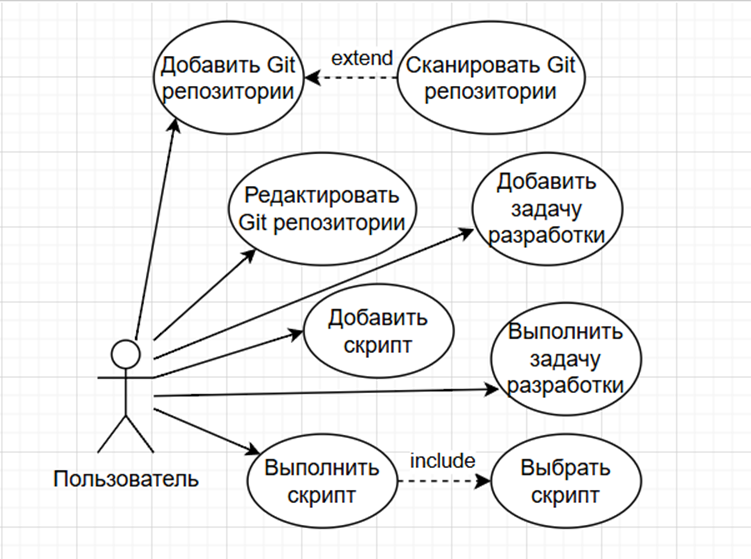
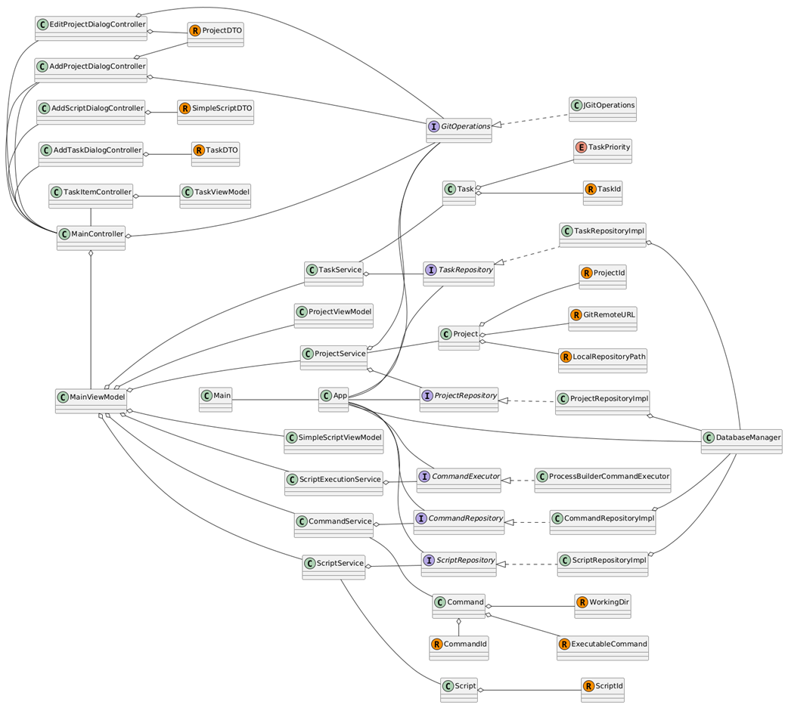
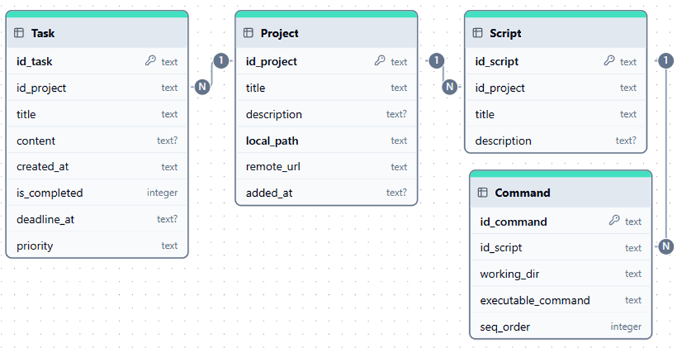
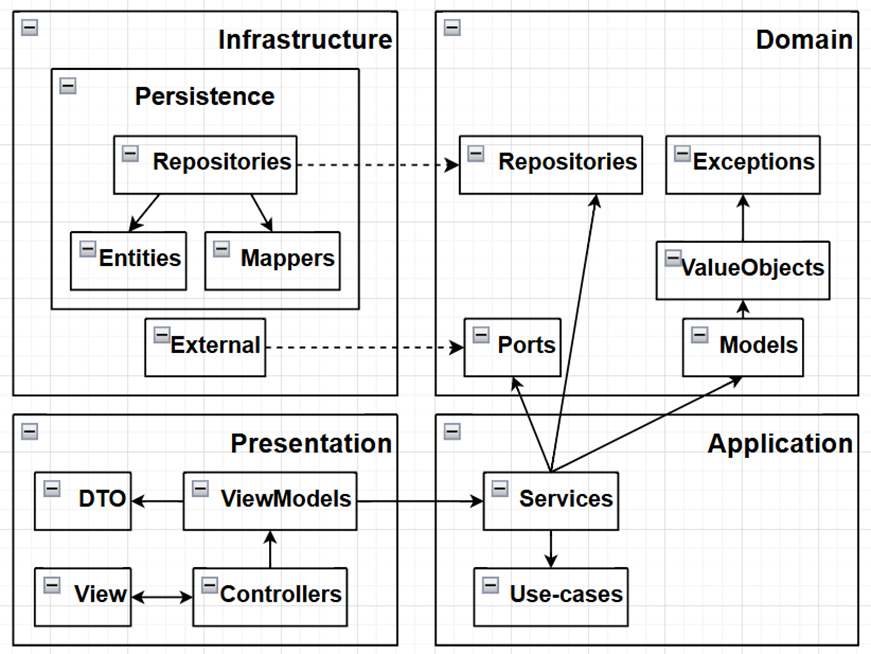
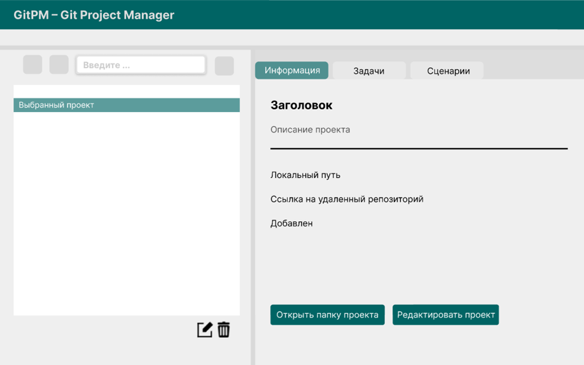

# Инструментальное ПО GitPM

GitPM представляет собой автоматизированную систему для комплексного управления локальными Git проектами.

Период проектирования и разработки: декабрь 2025 г.

## Описание

С архитектурной точки зрения, ПП представляет собой Desktop-приложение с графическим интерфейсом и базой данных.

Назначением данного ПП является учет сведений о локальных Git репозиториях, управление задачами разработки, а также создание и исполнение автоматизированных сценариев взаимодействия с проектами. Областью применимости ПП является разработка программного обеспечения, осуществляемая как частными лицами, так и в рамках IT-компаний.

## UML

### Диаграмма вариантов использования (Use Case)

### Диаграмма классов (Class)

## Физическая схема БД

## Архитектурная диаграмма

В качестве архитектуры ПО выбрана т.н. "Луковая архитектура" ("Onion architecture"). Диаграмма Луковой архитектуры в свободной нотации:

## Дизайн пользовательского интерфейса

В качестве опоры для построения графическгого интерфейса был сделан набросок дизайна.

## Программная реализация

Код реализации данного инструмента открыт и доступен по [ссылке](https://github.com/Honsage/GitPM).
