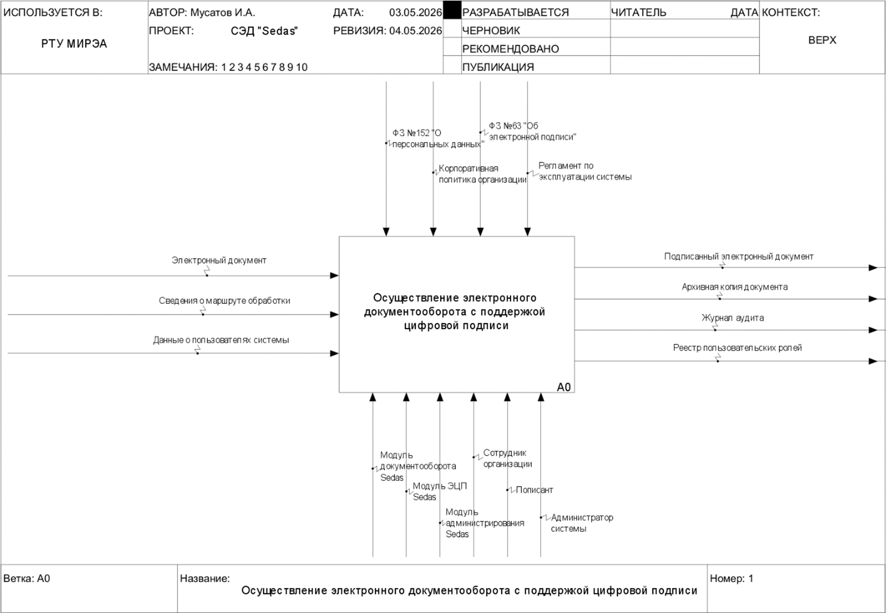
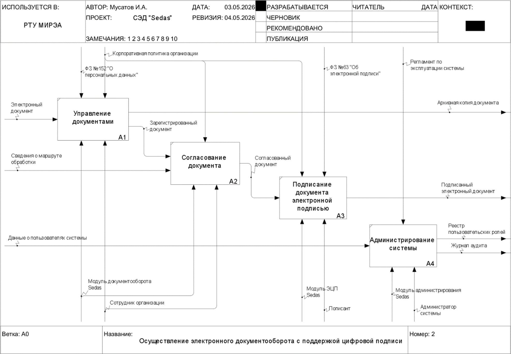
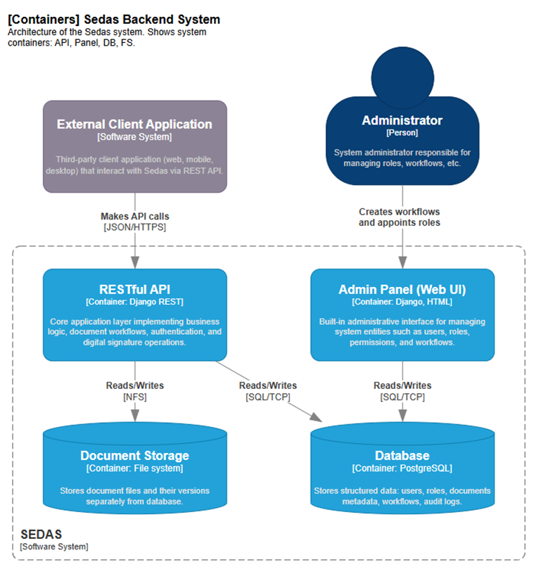
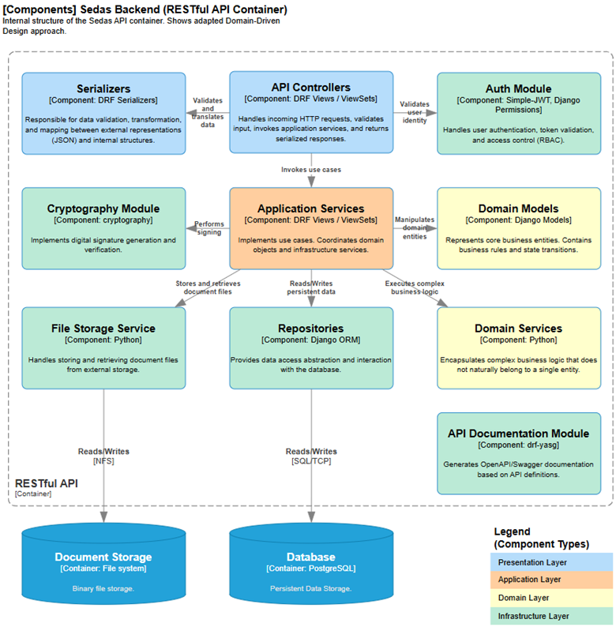
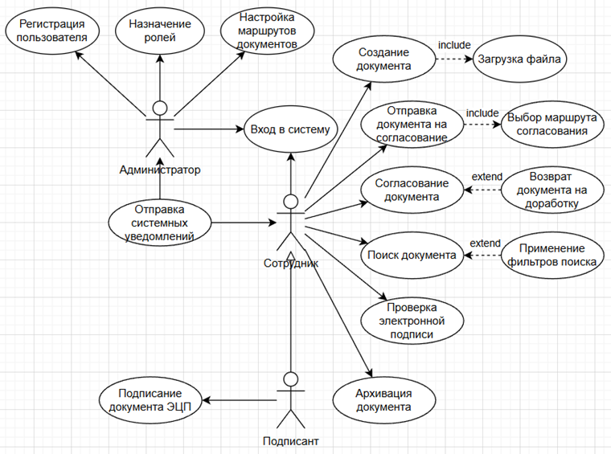
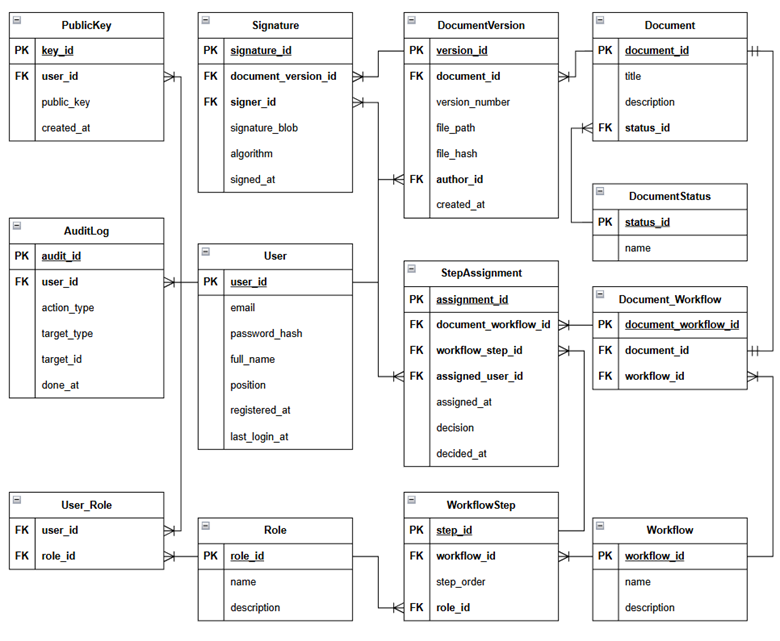

# Серверное приложение Sedas

Sedas представляет собой API-first серверную часть системы электронного документооборота и цифровой подписи.

Период проектирования и разработки: март – май 2026 г.

## Описание

С архитектурной точки зрения система представляет собой документированное RESTful API. 

Система предназначена для автоматизации процессов электронного документооборота с поддержкой механизмов цифровой подписи, а также предоставления платформы для управления жизненным циклом документов.

Областью применимости системы являются процессы документооборота в организациях малого и среднего бизнеса, а также некоммерческих организациях и государственных структурах.

## Спецификация требований к ПО

В соответствии с требованиями и ограничениями предметной области была составлена [Спецификация требований к системе Sedas](./src/SRS.md).

## IDEF0

## C4

## UML

### Диаграмма вариантов использования (Use Case)

Подробное описание прецедентов представлено в [Перечне прецедентов](./src/UseCases.md).

## ERD

## Программная реализация

Код реализации системы открыт и доступен по [ссылке](https://github.com/Honsage/Sedas).
